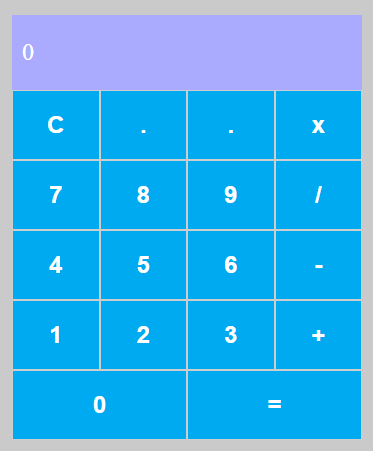

# 🧮 Calculadora React

Uma calculadora simples e intuitiva desenvolvida em **React**, com suporte às principais operações matemáticas.  
Este projeto foi criado como parte do meu portfólio para demonstrar habilidades em desenvolvimento web com React e boas práticas de código.

---

## 📱 Demonstração

🔗 [Acesse a calculadora online](https://leofsousa.github.io/calculadora-react/)  



---

## ✨ Funcionalidades

- ✅ Adição, Subtração, Multiplicação e Divisão  
- ✅ Limpar operação atual (*C*)  
- ✅ Interface responsiva  

---

## 🛠️ Tecnologias Utilizadas

As principais ferramentas usadas no projeto:


---

## ⚙️ Como Rodar o Projeto

```bash
# Clone este repositório
git clone https://github.com/leofsousa/calculadora-react.git

# Acesse a pasta do projeto
cd calculadora-react

# Instale as dependências
npm install

# Execute o projeto
npm start

## 🔮 Melhorias Futuras
- [ ] Implementar suporte ao teclado
- [ ] Adicionar operações avançadas (%, √, potência)
- [ ] Criar tema escuro


## 📬 Contato
- LinkedIn: www.linkedin.com/in/leonardo-sousa-71b32825a
- Email: leofsousa98@gmail.com
